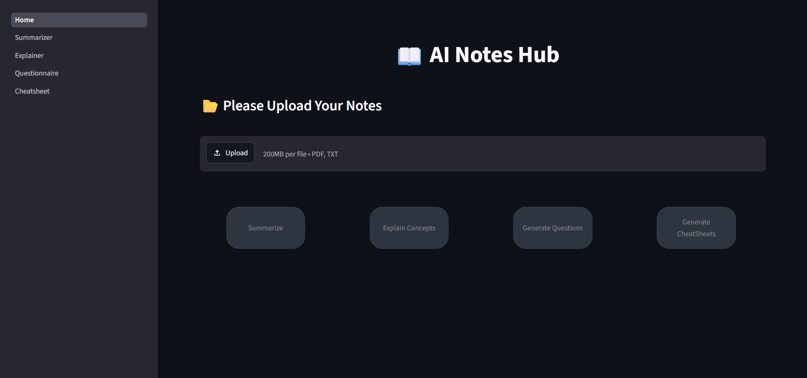
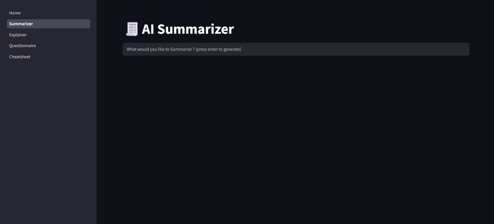
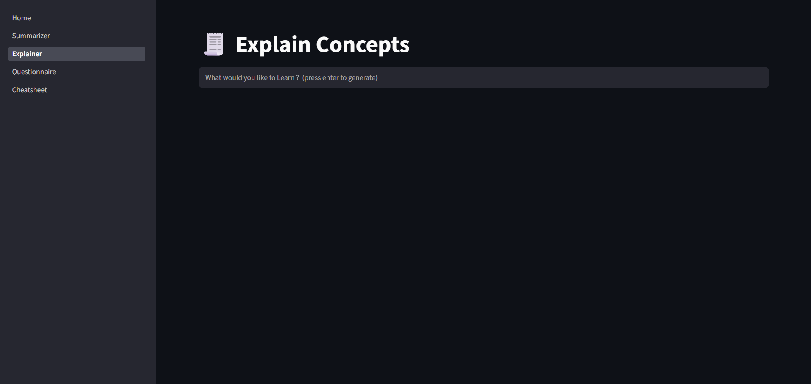
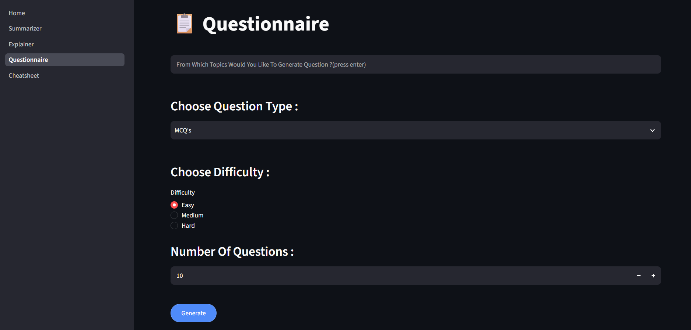
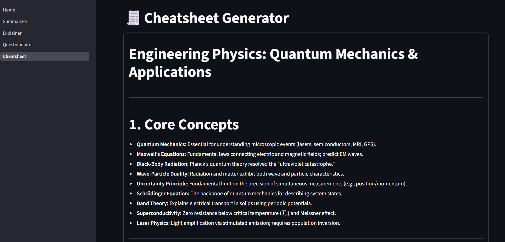

# 📚 AI Notes Hub

AI Notes Hub is an AI-powered study assistant designed to transform static notes into an interactive learning experience. Upload your study materials, ask questions in natural language, and instantly generate summaries, explanations, practice questions, and revision cheat sheets—all from your own documents.

The application is built to help students revise faster, understand concepts more deeply, and prepare efficiently for exams without manually searching through lengthy notes.

---

## ✨ Features

### 📂 Multiple Document Support
- Upload up to **5 PDF or TXT files** simultaneously.
- Automatically combines uploaded documents into a single searchable knowledge base.
- Detects duplicate uploads using file hashing to avoid unnecessary processing.
- Displays uploaded file names after successful processing. :contentReference[oaicite:0]{index=0}

---

### ⚡ Intelligent Document Processing

- Extracts text from PDF and TXT files.
- Creates an indexed document for semantic retrieval.
- Uses Retrieval-Augmented Generation (RAG) to provide context-aware responses.
- Falls back to the complete document whenever relevant context cannot be retrieved. :contentReference[oaicite:1]{index=1}

---
### 🛠️ Tech Stack
- **Frontend/UI**: Streamlit
- **LLM Engine**: Google Gemini API (`gemini-3.1-flash-lite`)
- **Embeddings**: SentenceTransformers (`all-MiniLM-L6-v2`)
- **Vector Database**: ChromaDB
- **PDF Parsing**: PyMuPDF

---

## 🧾 AI Summarizer

Generate high-quality summaries directly from your uploaded notes.

The summarizer:

- Answers only using information contained in your documents.
- Produces structured Markdown output.
- Organizes information into logical sections.
- Highlights key concepts.
- Generates revision-ready notes.
- Includes definitions and comparison tables whenever applicable.
- Prevents hallucinated information by refusing to answer unsupported questions. :contentReference[oaicite:2]{index=2} :contentReference[oaicite:3]{index=3}

---

## 🎓 AI Explainer

Go beyond summarization by learning concepts like a classroom lecture.

The explainer:

- Uses the uploaded document as the primary source.
- Supplements explanations with verified academic knowledge when necessary.
- Explains concepts from basic to advanced.
- Provides examples and analogies.
- Describes underlying mechanisms.
- Highlights common misconceptions.
- Generates concise revision notes for quick review. :contentReference[oaicite:4]{index=4}

---

## ❓ Question Generator

Create practice questions directly from your notes.

Supports:

- Multiple Choice Questions (MCQs)
- Descriptive Questions
- Mixed Question Sets

Additional capabilities:

- Adjustable difficulty levels
- Custom number of questions
- Automatic answer keys
- Domain-aware question generation
- Questions generated strictly from uploaded content without adding outside information. :contentReference[oaicite:5]{index=5}

---

## 📄 Cheat Sheet Generator

Convert lengthy notes into concise, exam-focused revision material.

The generated cheat sheet includes:

- Core concepts
- Important definitions
- Key facts
- Comparison tables
- Important workflows
- Common mistakes
- Quick reference tables
- One-page revision sheet
- Last-minute revision points

The generator automatically adapts to the document type, ensuring that formulas, programming syntax, scientific equations, or other domain-specific content are included only when relevant. :contentReference[oaicite:6]{index=6}

---

## 🎯 Designed for Students

AI Notes Hub is ideal for:

- Exam Preparation
- Quick Revision
- Self Learning
- Assignment Preparation
- Concept Clarification
- Practice Question Generation
- Last-Minute Revision

---

## 🚀 User Experience

- Clean and intuitive interface
- Fast document processing
- Loading indicators during AI generation
- One-click navigation between tools
- Markdown formatted outputs for improved readability
- Download options for generated responses
- Prevents interaction until valid documents are uploaded. :contentReference[oaicite:7]{index=7}

---

## 📸 Screenshots

### Home Page

---

### AI Summarizer

---

### AI Explainer

---

### Question Generator

---

### Cheat Sheet Generator

---

## 💡 Vision

AI Notes Hub aims to make studying smarter rather than harder. Instead of spending hours searching through notes, students can instantly interact with their study material, generate personalized learning resources, and focus on understanding concepts rather than finding them.